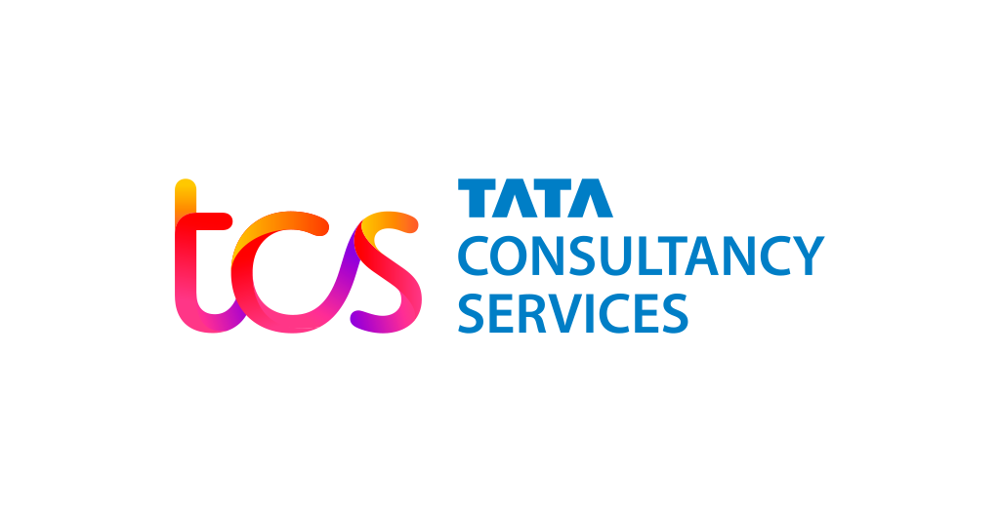
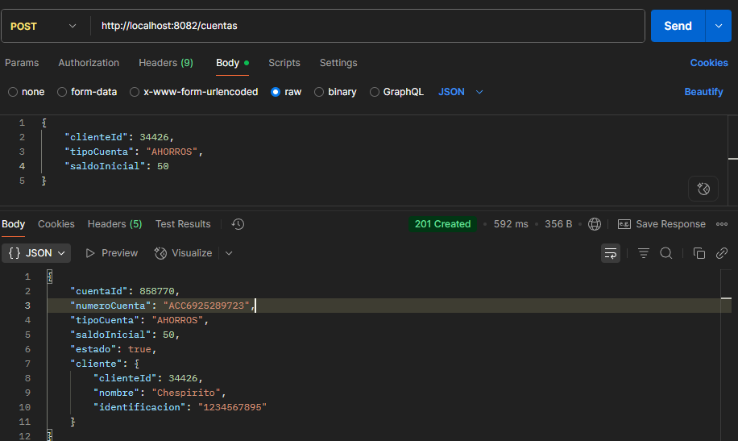
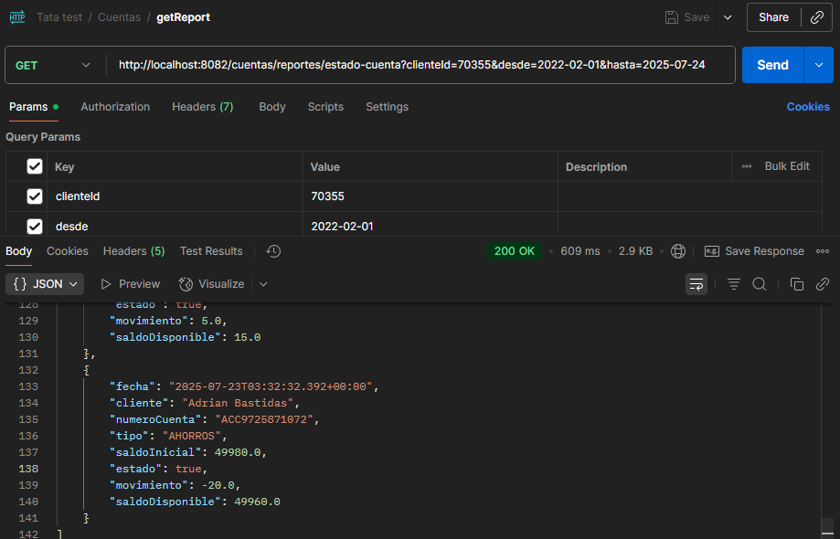
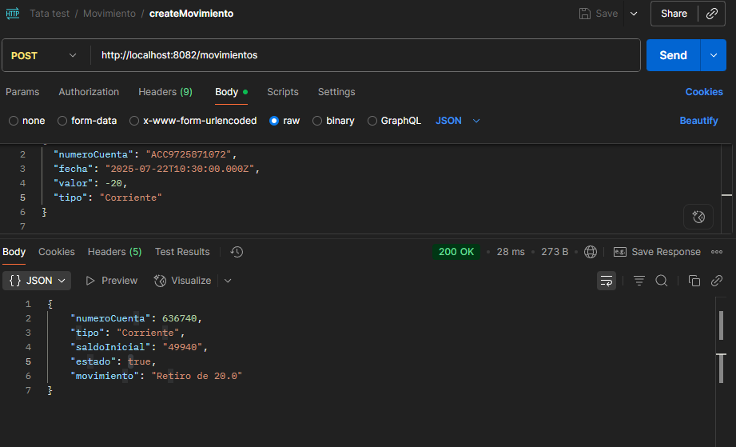
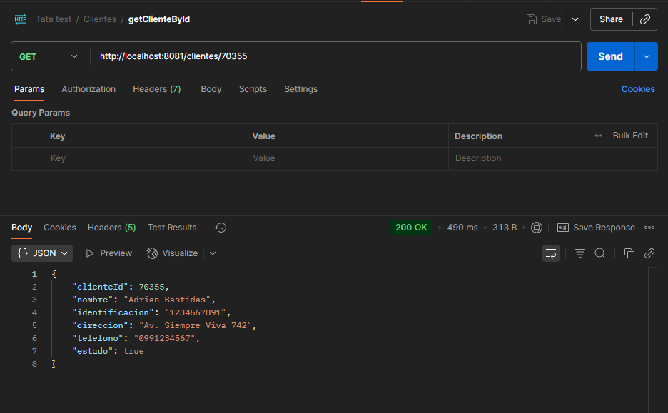

# Tcs back-end test

<div style="display:flex">

</div>

In this repository you will find a technical test provided by Tcs Consultant Services

## Built With

- Spring Boot
- Spring Data JPA
- Postgresql
- Typescript
- Git
- junit
- Feign Client

## 🚀 Requirements

Before running the project, make sure you have:

- Java 17 or higher
- Maven 3.6+
- PostgreSQL database
- (Optional) Docker to run the database locally
- An IDE like IntelliJ or VSCode for development

---

## ▶️ How to Run

1. **Clone the repository**

```bash
git clone git@github.com:Adrian-Bastidas/TATA-Back-End.git
```

2. **Go to the back-end project directory**
3. **Configure your database**

```bash
Make sure you have a database set up and update your application.properties or application.yml with your database credentials.

You can find the script in this repository
```

4. **Run the application**

## 🚀 Available Endpoints

```bash
The Postman collection for testing the available endpoints is included in this repository.
```

## 🚀 Examples






## Author

👤 **Adrian Rafael Bastidas Moya**

- GitHub: [@Adrian-Bastidas](https://github.com/Adrian-Bastidas)
- Facebook: [Adrian Bastidas](https://www.facebook.com/rafdrian/)
- LinkedIn: [Adrian Rafael Bastidas Moya](https://www.linkedin.com/in/adrian-rafael-bastidas-moya-5b940419b/)
